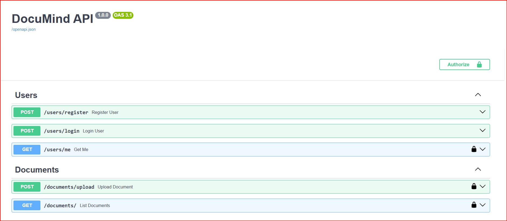
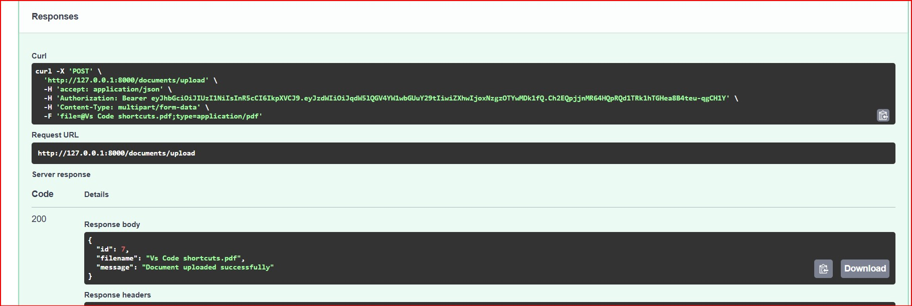
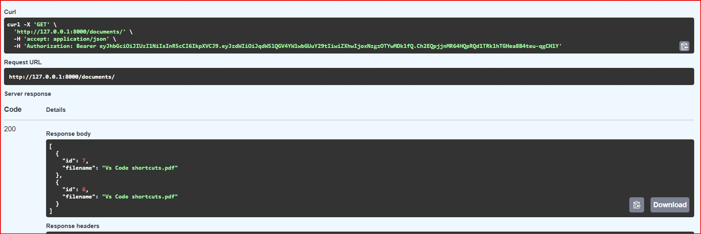
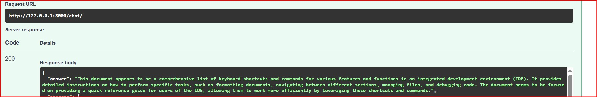
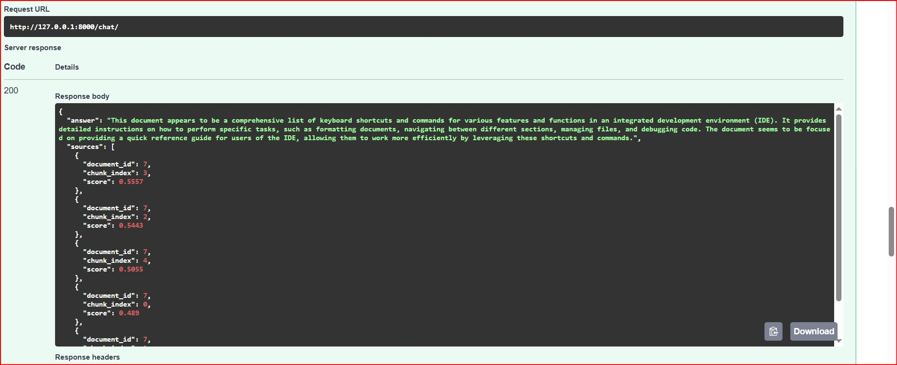

# DocuMind

Developed by **Manu**

An AI-powered document intelligence platform built with FastAPI, PostgreSQL, and Ollama that enables users to upload PDF documents and interact with them using Retrieval-Augmented Generation (RAG).

---

## Features

- JWT Authentication
- PDF Upload
- PDF Text Extraction
- Intelligent Document Chunking
- Sentence Transformer Embeddings
- Semantic Search
- Retrieval-Augmented Generation (RAG)
- Multi-Document Chat
- Conversation Memory
- Source Citations
- PostgreSQL Database
- REST API with Swagger UI

---

## Tech Stack

### Backend

- Python
- FastAPI
- SQLAlchemy
- PostgreSQL
- Alembic
- Pydantic

### AI

- Ollama
- Llama 3.2
- Sentence Transformers

### Authentication

- JWT

### PDF Processing

- PyMuPDF

---

## Architecture

```text
User
   │
   ▼
FastAPI API
   │
JWT Authentication
   │
PDF Upload
   │
PDF Text Extraction
   │
Chunking
   │
Embedding Generation
   │
Semantic Search (RAG)
   │
Ollama (Llama 3.2)
   │
Answer + Source Citations
```

---

## Screenshots

### Swagger API



---

### Upload Document



---

### Documents



---

### AI Chat



---

### Source Citations



---

## Project Structure

```text
app/
├── ai/
├── api/
├── auth/
├── core/
├── db/
├── models/
├── schemas/
├── services/
├── utils/
└── main.py

alembic/
uploads/
assets/
```

---

## API Endpoints

### Users

- POST `/users/register`
- POST `/users/login`
- GET `/users/me`

### Documents

- POST `/documents/upload`
- GET `/documents`

### Chat

- POST `/chat`

### Search

- POST `/search`

---

## Installation

Clone the repository

```bash
git clone <repository-url>
```

Move into the project directory

```bash
cd documind
```

Create a virtual environment

```bash
python -m venv .venv
```

Activate the environment (Windows)

```bash
.venv\Scripts\activate
```

Install dependencies

```bash
pip install -r requirements.txt
```

Create a `.env` file

```env
DATABASE_URL=your_database_url
JWT_SECRET_KEY=your_secret_key
ACCESS_TOKEN_EXPIRE_MINUTES=30
```

Run the application

```bash
uvicorn app.main:app --reload
```

Open Swagger

```text
http://127.0.0.1:8000/docs
```

---

## Current Status

✅ Backend MVP completed

### Upcoming Improvements

- React Frontend
- Docker Support
- Cloud Deployment
- pgvector Integration
- Streaming Responses

---

## License

This project was built for learning, experimentation, and portfolio purposes.